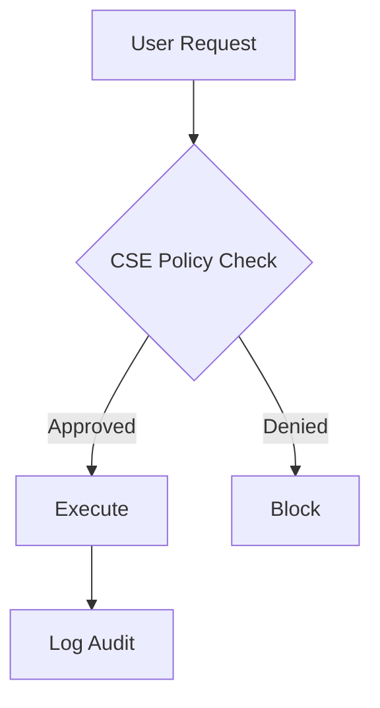
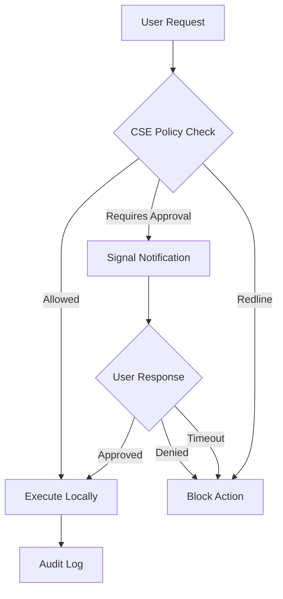

# CLAUDE.md - AI Assistant Guide for AI-Ready Homelab

**Last Updated**: 2025-11-14 | **Version**: 1.0.0

**Purpose**: This file guides AI assistants (like Claude) in understanding the AI-Ready Homelab codebase structure, development workflows, and conventions to provide effective assistance.

---

## Table of Contents

1. [Repository Overview](#repository-overview)
2. [Core Philosophy and Principles](#core-philosophy-and-principles)
3. [Codebase Structure](#codebase-structure)
4. [Key Files and Their Purposes](#key-files-and-their-purposes)
5. [Development Workflows](#development-workflows)
6. [Coding Conventions and Style](#coding-conventions-and-style)
7. [Architecture and Design Patterns](#architecture-and-design-patterns)
8. [Important Concepts and Terminology](#important-concepts-and-terminology)
9. [Common Tasks and How to Accomplish Them](#common-tasks-and-how-to-accomplish-them)
10. [Testing and Validation](#testing-and-validation)
11. [Git Workflow](#git-workflow)
12. [Safety Practices and Guardrails](#safety-practices-and-guardrails)
13. [Documentation Standards](#documentation-standards)
14. [Integration Points](#integration-points)
15. [Troubleshooting and Common Issues](#troubleshooting-and-common-issues)

---

## Repository Overview

### What This Repository Is

The **AI-Ready Homelab Framework** is an SRE-inspired operational framework for running a homelab with local AI assistance. It is NOT a tool or application - it's a **methodology and governance framework** for operating self-hosted infrastructure reliably.

**Key Characteristics**:
- **Privacy-first**: Local AI by default, cloud optional with sanitization
- **SRE governance**: STATUS.md cadence, verification windows, DR testing
- **Production-tested**: Used in real homelab for months with documented results
- **Modular adoption**: Can be implemented incrementally (10 min → 2-3 hours → 6-12 hours)
- **Tool-agnostic**: Works with any infrastructure (Docker, Proxmox, HA, K8s, etc.)

### Repository Statistics

- **License**: MIT
- **Version**: 1.0.0
- **Size**: ~790KB
- **Files**: ~60 files
- **Primary Language**: Documentation (Markdown), with Python validation tools
- **Status**: Active development, preparing for public launch (November 2025)

### Target Audience

1. Homelab owners wanting reliability without constant tinkering
2. Privacy-minded self-hosters
3. Users of Home Assistant, Docker, Proxmox, Frigate, pfSense, n8n, etc.
4. Anyone applying SRE discipline to personal infrastructure
5. People wanting AI assistance without surrendering data or control

---

## Core Philosophy and Principles

### Guiding Principles

1. **Privacy-first**: Local AI by default, cloud optional and sanitized
2. **SRE discipline**: Governance and reliability over features
3. **Production-ready**: Real-world tested, not theoretical
4. **Accessible**: Clear documentation for all skill levels
5. **Opinionated**: Better to have a clear way than many mediocre ways
6. **Human-in-the-loop**: AI assists, humans decide
7. **Verification windows**: Reliability proven by stable behavior over time, not immediate success
8. **Documentation as discipline**: STATUS.md is operational heartbeat, not just a log

### What Makes This Framework Distinct

1. **SRE Governance**: Lightweight operational discipline adapted for homelabs
2. **Local-First AI**: AI operates entirely on local models, hybrid mode optional
3. **Guardrails for Safety**: CSE policy system prevents destructive actions
4. **Privacy and Sanitization**: Dedicated n8n workflow strips sensitive data
5. **Architecture Transparency**: Every component documented visually and textually

---

## Codebase Structure

### Directory Tree

```
AI-Ready-Homelab/
├── .github/                          # GitHub automation & templates
│   ├── workflows/                    # CI/CD workflows
│   │   └── cse-policy-validate.yml   # CSE policy validation
│   └── ISSUE_TEMPLATE/               # Issue/PR templates
│
├── commercial/                       # Commercial service offerings (optional)
│   └── local-ai-conversion.md        # Professional services documentation
│
├── docs/                             # Documentation
│   ├── architecture/                 # System design & diagrams
│   │   └── diagrams/                 # Mermaid architecture diagrams
│   │       ├── README.md             # Visual gallery
│   │       ├── local-ai-ops.mmd      # Local-first AI operations
│   │       ├── hybrid-ai.mmd         # Hybrid AI architecture
│   │       ├── cse-guardrails.mmd    # CSE approval workflow
│   │       ├── hybrid-mode-switch.mmd # Mode switching FSM
│   │       ├── network.mmd           # VLAN network topology
│   │       └── services.mmd          # Service integration
│   ├── comparisons/                  # Competitive analysis
│   │   └── vs-homelab-mcp-repos.md   # vs other projects
│   ├── discussions-seed/             # GitHub Discussions templates
│   └── images/                       # Documentation images
│       └── hybrid-ai-architecture.png
│
├── samples/                          # Template files
│   ├── STATUS.sample.md              # Service health tracking template
│   └── PENDING-WORK.sample.md        # Project tracking template
│
├── sre-kit/                          # SRE governance framework
│   ├── STATUS-workflow.md            # Complete STATUS.md guide
│   ├── incident-template.md          # Incident reporting template
│   ├── dr-test-matrix.md             # Disaster recovery testing
│   └── examples/
│       └── cse-policy.example.yaml   # CSE policy template
│
├── tools/                            # Automation & validation tools
│   ├── cse_policy_validator.py       # Python CSE policy validator
│   └── n8n/                          # n8n workflows
│       └── preflight_sanitize.n8n.json # Privacy sanitization
│
├── README.md                         # Main project documentation
├── CONTRIBUTING.md                   # Contribution guidelines
├── CODE_OF_CONDUCT.md                # Contributor Covenant v2.0
├── SECURITY.md                       # Security policy
├── SUPPORT.md                        # Support channels
├── LICENSE                           # MIT License
└── .gitignore                        # Git ignore rules
```

### Directory Purposes

| Directory | Purpose | Key Files |
|-----------|---------|-----------|
| `.github/` | GitHub automation, issue templates, PR templates | `cse-policy-validate.yml` |
| `commercial/` | Professional services documentation (not yet public) | `local-ai-conversion.md` |
| `docs/` | All documentation, architecture diagrams, comparisons | `architecture/diagrams/`, `comparisons/` |
| `samples/` | Copy-paste templates for immediate use | `STATUS.sample.md`, `PENDING-WORK.sample.md` |
| `sre-kit/` | **Core framework** - SRE governance templates and guides | `STATUS-workflow.md`, `dr-test-matrix.md` |
| `tools/` | Validation scripts and automation workflows | `cse_policy_validator.py`, `preflight_sanitize.n8n.json` |

---

## Key Files and Their Purposes

### Root Level Files

| File | Purpose | When to Read/Edit |
|------|---------|-------------------|
| `README.md` | Main project overview, quick start, FAQ | First file to read; update for major changes |
| `CONTRIBUTING.md` | Contribution guidelines and process | Before contributing; update when process changes |
| `SECURITY.md` | Security vulnerability reporting | When security issues found |
| `SUPPORT.md` | Support channels and resources | When users need help |
| `CODE_OF_CONDUCT.md` | Community standards | Rarely edited |
| `LICENSE` | MIT License | Never edit |
| `.gitignore` | Git exclusions (STATUS.md, secrets, etc.) | When adding new file types to exclude |

### SRE Kit Files (Core Framework)

| File | Lines | Purpose | Update Frequency |
|------|-------|---------|------------------|
| `sre-kit/STATUS-workflow.md` | 355 | Complete guide to STATUS.md workflow, philosophy, best practices | When workflow evolves |
| `sre-kit/incident-template.md` | ~250 | Structured incident reporting template | When incident process changes |
| `sre-kit/dr-test-matrix.md` | ~350 | Quarterly DR testing framework with 6 scenarios | When adding new DR scenarios |
| `sre-kit/examples/cse-policy.example.yaml` | ~100 | CSE policy template with all configurations | When adding new policy features |

### Template Files

| File | Lines | Purpose | User Action |
|------|-------|---------|-------------|
| `samples/STATUS.sample.md` | ~250 | Service health tracking template | **Copy to root as STATUS.md** |
| `samples/PENDING-WORK.sample.md` | ~300 | Project tracking template | **Copy to root as PENDING-WORK.md** |

**IMPORTANT**: These files are excluded in `.gitignore` when copied to root (STATUS.md, PENDING-WORK.md) because they contain user-specific operational data.

### Tools and Scripts

| File | Language | Purpose | Exit Codes |
|------|----------|---------|------------|
| `tools/cse_policy_validator.py` | Python 3 | Validates CSE policy YAML structure, security, TTLs | 0=valid, 1=invalid |
| `tools/n8n/preflight_sanitize.n8n.json` | JSON | n8n workflow with 10 redaction rules for privacy | N/A (workflow) |

### Architecture Diagrams

All diagrams are in Mermaid format (`.mmd` files) in `docs/architecture/diagrams/`:

| Diagram | Lines | Purpose | Key Components |
|---------|-------|---------|----------------|
| `local-ai-ops.mmd` | 85 | Local-first AI architecture | 10 agents, 65 MCP tools, CSE guardrails |
| `hybrid-ai.mmd` | 59 | Hybrid mode with privacy | Preflight sanitizer, cloud planning, local execution |
| `cse-guardrails.mmd` | ~50 | CSE approval workflow | Policy checks, redline triggers, approval gates |
| `hybrid-mode-switch.mmd` | ~40 | Mode switching FSM | Local-only → Hybrid → Cloud-enhanced transitions |
| `network.mmd` | ~60 | Network topology | 4 VLANs, pfSense, Proxmox, services |
| `services.mmd` | ~70 | Service integration | Agent-to-infrastructure mapping |

**Rendering**: All diagrams are rendered in `docs/architecture/diagrams/README.md` for visual reference.

---

## Development Workflows

### 1. Documentation Changes

**When**: Improving docs, fixing typos, adding examples, updating guides

**Process**:
1. Read the file to understand context
2. Make changes following markdown style (120 char lines, code blocks, examples)
3. Update "Last Updated" date if present
4. Test rendering if adding diagrams
5. Commit with descriptive message: `"docs: improve STATUS workflow guide with verification examples"`

**Common Changes**:
- Adding examples to templates
- Fixing typos or unclear instructions
- Updating architecture diagrams
- Adding new runbook examples

### 2. Template Changes

**When**: Improving sample templates, adding new sections, fixing structure

**Process**:
1. Edit files in `samples/` directory (never edit user's root STATUS.md)
2. Test template by copying to test directory
3. Ensure examples are realistic (not just placeholders)
4. Update related documentation (e.g., `STATUS-workflow.md` if STATUS.sample.md changes)
5. Commit: `"templates: add verification window examples to STATUS.sample.md"`

### 3. Tool/Script Changes

**When**: Improving validator, adding validation rules, fixing bugs

**Process**:
1. Edit `tools/cse_policy_validator.py`
2. Test locally: `python tools/cse_policy_validator.py sre-kit/examples/cse-policy.example.yaml`
3. Ensure exit codes correct (0=valid, 1=invalid)
4. Update docstring if adding features
5. Test CI workflow passes: `.github/workflows/cse-policy-validate.yml`
6. Commit: `"tools: add validation for destructive command patterns"`

### 4. CSE Policy Changes

**When**: Adding infrastructure types, changing approval workflows, updating examples

**Process**:
1. Edit `sre-kit/examples/cse-policy.example.yaml`
2. Run validator: `python tools/cse_policy_validator.py sre-kit/examples/cse-policy.example.yaml`
3. Fix any errors/warnings
4. Update related docs if structure changes
5. Commit: `"cse: add kubernetes infrastructure to example policy"`

### 5. Architecture Diagram Changes

**When**: Adding new diagrams, updating existing ones, fixing layout

**Process**:
1. Edit `.mmd` files in `docs/architecture/diagrams/`
2. Test rendering in `docs/architecture/diagrams/README.md`
3. Ensure Mermaid syntax is valid
4. Keep diagrams focused (split complex diagrams)
5. Update README.md gallery if adding new diagram
6. Commit: `"docs: add MCP tool integration diagram"`

### 6. GitHub Templates Changes

**When**: Improving issue templates, PR template, bug report forms

**Process**:
1. Edit files in `.github/ISSUE_TEMPLATE/` or `.github/pull_request_template.md`
2. Test by creating test issue/PR (if possible)
3. Ensure YAML syntax valid for issue forms
4. Commit: `"github: add environment section to bug report template"`

---

## Coding Conventions and Style

### Documentation Style (Markdown)

**Line Length**: 120 characters maximum (flexible for tables/code blocks)

**Headings**:
- Use ATX style (`#`, `##`, `###`)
- One H1 per document
- Hierarchical structure (don't skip levels)

**Code Blocks**:
```markdown
Use triple backticks with language identifier:

```bash
docker ps
```

```yaml
version: 1.0
```
```

**Lists**:
- Use `-` for unordered lists
- Use `1.`, `2.`, `3.` for ordered lists
- Indent nested lists with 2 spaces

**Emphasis**:
- **Bold** for important terms first appearance
- *Italic* for emphasis
- `Code` for commands, files, variables

**Tables**:
```markdown
| Column 1 | Column 2 | Column 3 |
|----------|----------|----------|
| Value    | Value    | Value    |
```

**Links**:
- Use relative links for internal files: `[Status Workflow](sre-kit/STATUS-workflow.md)`
- Use absolute links for external resources: `https://example.com`

### Python Style (cse_policy_validator.py)

**Style Guide**: PEP 8 with some flexibility

**Key Conventions**:
- Class names: `PascalCase` (e.g., `CSEPolicyValidator`)
- Function names: `snake_case` (e.g., `validate_structure`)
- Constants: `UPPER_SNAKE_CASE` (e.g., `MAX_TTL_MINUTES`)
- Private methods: `_leading_underscore` (e.g., `_validate_metadata`)

**Docstrings**:
```python
def validate(self) -> bool:
    """Run all validations. Returns True if valid, False otherwise."""
    pass
```

**Type Hints**: Use where helpful (not mandatory for simple functions)

**Error Handling**: Collect errors, print at end (don't exit early)

### YAML Style (CSE Policy Files)

**Indentation**: 2 spaces (not tabs)

**Structure**:
```yaml
version: 1.0
metadata:
  name: "descriptive-name"
  description: "Clear description"
  owner: "username"
  last_updated: "YYYY-MM-DD"

infrastructures:
  homeassistant:
    enabled: true
    ttl_minutes: 60
    requires_approval: false
    allowed_commands:
      - "ha restart"
      - "ha logs --follow"
```

**Booleans**: Use `true`/`false` (not `yes`/`no`)

**Strings**: Quote when contains special chars or for clarity

### Diagram Style (Mermaid)

**Keep Simple**: One concept per diagram

**Consistent Styling**:
- Use meaningful node IDs
- Add descriptive labels
- Group related components

**Example**:


---

## Architecture and Design Patterns

### Layered Architecture

The framework follows a 4-layer architecture:

```
┌─────────────────────────────────────────┐
│      OPERATIONAL LAYER                  │  ← STATUS.md, PENDING-WORK.md
│  (What you do daily/weekly)             │    Incident reports, DR tests
└─────────────────────────────────────────┘
              ↓
┌─────────────────────────────────────────┐
│      GOVERNANCE LAYER                   │  ← CSE Policy, Validator
│  (Policy and boundaries)                │    Preflight Sanitizer
└─────────────────────────────────────────┘
              ↓
┌─────────────────────────────────────────┐
│      EXECUTION LAYER                    │  ← 10 Specialized Agents
│  (AI agents and automation)             │    65 MCP Tools
└─────────────────────────────────────────┘
              ↓
┌─────────────────────────────────────────┐
│      INFRASTRUCTURE LAYER               │  ← Network (VLANs)
│  (Physical/virtual systems)             │    Proxmox, Docker, Services
└─────────────────────────────────────────┘
```

### Key Design Patterns

#### 1. Verification Windows Pattern

**Problem**: How to ensure changes are stable, not just successful?

**Solution**:
- Don't mark changes "completed" immediately
- Move to "Pending Verification" with specific time window (24h-1week)
- Require evidence of stability before marking complete

**Implementation**: STATUS.md workflow

#### 2. Privacy-First Sanitization Pattern

**Problem**: How to use cloud AI without exposing sensitive data?

**Solution**:
- All data passes through preflight sanitizer BEFORE cloud
- 10 redaction rules strip secrets, IPs, emails, tokens
- Local execution only, cloud for planning
- Redaction is mandatory, not optional

**Implementation**: `tools/n8n/preflight_sanitize.n8n.json`

#### 3. Policy-Based Approval Pattern

**Problem**: How to give AI capability without risk?

**Solution**:
- CSE policy defines what's allowed per infrastructure
- Redline triggers for destructive operations
- Human approval gates with timeouts
- Audit logging for all actions

**Implementation**: `sre-kit/examples/cse-policy.example.yaml`

#### 4. Finite State Machine for Mode Switching

**Problem**: How to transition between local/hybrid/cloud modes safely?

**Solution**:
- Explicit states: Local-Only → Hybrid → Cloud-Enhanced
- User-initiated transitions only
- Each state has clear boundaries and requirements
- Rollback path always available

**Implementation**: `docs/architecture/diagrams/hybrid-mode-switch.mmd`

#### 5. Template-Driven Adoption Pattern

**Problem**: How to make framework easy to adopt incrementally?

**Solution**:
- Provide working examples, not just empty templates
- Three adoption tiers (10 min, 2-3 hours, 6-12 hours)
- Copy-paste ready samples with realistic data
- Users customize, don't build from scratch

**Implementation**: `samples/` directory

---

## Important Concepts and Terminology

### Core Concepts

#### STATUS.md
**Definition**: A living snapshot of infrastructure health, updated on a cadence (daily/weekly)

**Not**: A log, incident report, or changelog

**Purpose**: Operational heartbeat, verification windows, reliability tracking

**File**: `samples/STATUS.sample.md`, Guide: `sre-kit/STATUS-workflow.md`

#### Verification Windows
**Definition**: Time periods (24h-1week) during which a change must remain stable before marking complete

**Purpose**: Catch regressions early, prove reliability over time

**Example**: "Restarted Frigate → Pending Verification (48h) → Verified Stable"

#### CSE (Claude Supervised Execute)
**Definition**: Policy-based system that governs what AI can do

**Components**: Policy file (YAML), approval workflow, redline triggers, audit logging

**Purpose**: Give AI capability without surrendering control

#### Preflight Sanitization
**Definition**: Privacy-preserving redaction before cloud AI use

**Redacts**: Tokens, secrets, emails, IPs (external), MAC addresses, GPS, etc.

**Preserves**: RFC1918 private IPs, functional data structure

**Implementation**: n8n workflow with 10 redaction rules

#### MCP (Model Context Protocol)
**Definition**: Standard protocol for AI models to interact with tools/services

**In this framework**: 65 MCP tools across 7 infrastructure systems

**Purpose**: AI agents use MCP to access Home Assistant, Docker, Proxmox, etc.

#### DR Testing (Disaster Recovery)
**Definition**: Quarterly testing of backup restoration, failure scenarios

**Framework**: 6 test scenarios with RTO/RPO targets

**Purpose**: Ensure backups work BEFORE you need them

**File**: `sre-kit/dr-test-matrix.md`

### Terminology

| Term | Definition | File Reference |
|------|------------|----------------|
| **SRE** | Site Reliability Engineering - discipline for production reliability | All sre-kit/ files |
| **Homelab** | Self-hosted infrastructure (servers, services, network) | README.md |
| **Agent** | Specialized AI assistant (e.g., ha-yaml-validator, docker-troubleshooter) | `local-ai-ops.mmd` |
| **Redline** | Hard block in CSE policy (destructive commands, WAN changes) | `cse-guardrails.mmd` |
| **Hybrid Mode** | Local AI + cloud planning with sanitization | `hybrid-ai.mmd` |
| **Local-Only** | No cloud AI, 100% local (default mode) | `local-ai-ops.mmd` |
| **Runbook** | Step-by-step operational procedure | `incident-template.md` |
| **MTBF** | Mean Time Between Failures | `STATUS-workflow.md:310` |
| **MTTR** | Mean Time To Recovery | `STATUS-workflow.md:311` |
| **RTO** | Recovery Time Objective (DR) | `dr-test-matrix.md` |
| **RPO** | Recovery Point Objective (DR) | `dr-test-matrix.md` |

---

## Common Tasks and How to Accomplish Them

### Task 1: Add New Documentation File

**Location**: `docs/` directory (or subdirectory)

**Steps**:
1. Create file with descriptive name: `docs/guides/new-guide.md`
2. Start with H1 heading and metadata:
   ```markdown
   # New Guide Title

   **Last Updated**: YYYY-MM-DD | **Version**: 1.0.0
   ```
3. Write content following markdown style
4. Add to navigation (README.md or parent directory README)
5. Commit: `"docs: add guide for X"`

### Task 2: Update STATUS.sample.md Template

**File**: `samples/STATUS.sample.md`

**Steps**:
1. Read current template to understand structure
2. Add new section or improve examples
3. Ensure examples are realistic (not placeholders)
4. Update `sre-kit/STATUS-workflow.md` if structure changed
5. Test by copying to test directory
6. Commit: `"templates: add X section to STATUS template"`

### Task 3: Add New Validation Rule to CSE Validator

**File**: `tools/cse_policy_validator.py`

**Steps**:
1. Add validation logic to appropriate method or create new method:
   ```python
   def _validate_new_feature(self):
       """Validate new feature"""
       if 'new_key' not in self.policy:
           self.errors.append("Missing new_key")
   ```
2. Call from `validate()` method
3. Test with example policy:
   ```bash
   python tools/cse_policy_validator.py sre-kit/examples/cse-policy.example.yaml
   ```
4. Add test case to `sre-kit/examples/cse-policy.example.yaml` if needed
5. Commit: `"tools: add validation for X in CSE policies"`

### Task 4: Create New Architecture Diagram

**Location**: `docs/architecture/diagrams/`

**Steps**:
1. Create `.mmd` file: `docs/architecture/diagrams/new-diagram.mmd`
2. Write Mermaid diagram:
   ```mermaid
   graph TD
       A[Component A] --> B[Component B]
       B --> C[Component C]
   ```
3. Add to gallery in `docs/architecture/diagrams/README.md`:
   ```markdown
   ### New Diagram Title

   Description of what this diagram shows.

   ```mermaid
   [paste diagram here]
   ```
   ```
4. Test rendering in GitHub or Mermaid Live Editor
5. Commit: `"docs: add diagram showing X"`

### Task 5: Fix Documentation Typo

**Steps**:
1. Read file to understand context
2. Fix typo
3. Check for other typos nearby
4. Commit: `"docs: fix typo in [filename]"` (lowercase, simple)

### Task 6: Add Service-Specific Runbook

**Location**: Create new file (e.g., `docs/runbooks/frigate-restart.md` or in `sre-kit/examples/`)

**Steps**:
1. Follow incident template structure: `sre-kit/incident-template.md`
2. Include:
   - Service overview
   - Pre-restart checks
   - Restart procedure
   - Validation steps
   - Rollback procedure
   - Common issues and fixes
3. Add to documentation index
4. Commit: `"docs: add runbook for [service] restart procedure"`

### Task 7: Update CSE Policy Example

**File**: `sre-kit/examples/cse-policy.example.yaml`

**Steps**:
1. Make changes following YAML style
2. Validate: `python tools/cse_policy_validator.py sre-kit/examples/cse-policy.example.yaml`
3. Fix errors/warnings
4. Update "last_updated" field in metadata
5. Commit: `"cse: update example policy with X"`

---

## Testing and Validation

### CSE Policy Validation

**Tool**: `tools/cse_policy_validator.py`

**Usage**:
```bash
python tools/cse_policy_validator.py <policy-file.yaml>
```

**Exit Codes**:
- `0` = Valid policy (may have warnings)
- `1` = Invalid policy (has errors)

**What It Validates**:
1. **Structure**: Required top-level keys (version, metadata, infrastructures, approval_workflow)
2. **Metadata**: Required fields (name, description, owner, last_updated)
3. **Infrastructures**: Per-infrastructure config (enabled, ttl_minutes, requires_approval, allowed_commands)
4. **TTL Ranges**: 5-480 minutes (5 min - 8 hours)
5. **Approval Workflow**: Valid mode (interactive/notify-only/auto-approve), timeout
6. **Regex Patterns**: Valid regex in allowed_commands
7. **Security**: No overly permissive patterns (`*`, `.*`), destructive commands require approval

**Example Output**:
```
✅ VALID: sre-kit/examples/cse-policy.example.yaml
   All checks passed!

⚠️  2 warning(s):
  1. infrastructures.homeassistant.allowed_commands: pattern 'ha .*' is broad
```

### CI/CD Validation

**Workflow**: `.github/workflows/cse-policy-validate.yml`

**Triggers**:
- Pull requests affecting:
  - `sre-kit/**/*.yaml`
  - `sre-kit/**/*.yml`
  - `cse-policy*.yml`
  - `cse-policy*.yaml`
  - `tools/**`

**Actions**:
1. Checkout repository
2. Setup Python 3.x
3. Install PyYAML
4. Validate example policy
5. Validate any additional CSE policies
6. Fail if validation fails

**When to Update**:
- Adding new validation rules
- Changing policy structure
- Adding new example policies

### Manual Testing Checklist

When making changes, test:

**Documentation Changes**:
- [ ] Markdown renders correctly
- [ ] Links work (relative and absolute)
- [ ] Code blocks have correct syntax highlighting
- [ ] Tables format correctly
- [ ] Images load

**Template Changes**:
- [ ] Copy template to test directory
- [ ] Fill out with realistic data
- [ ] Verify structure makes sense
- [ ] Check examples are clear

**Tool Changes**:
- [ ] Run validator on example policy
- [ ] Test with invalid policy (should fail)
- [ ] Test with missing keys (should error)
- [ ] Verify exit codes correct

**Diagram Changes**:
- [ ] Test in Mermaid Live Editor
- [ ] Verify rendering in README.md
- [ ] Check node labels are clear
- [ ] Ensure layout is readable

---

## Git Workflow

### Branch Strategy

**Main Branch**: `main` (or no specified main branch)

**Development**: Feature branches from main

**Branch Naming**:
- `feature/description` - New features
- `docs/description` - Documentation changes
- `fix/description` - Bug fixes
- `tools/description` - Tool/script changes

**Examples**:
- `feature/add-kubernetes-support`
- `docs/improve-status-workflow`
- `fix/validator-regex-bug`
- `tools/add-ttl-validation`

### Commit Message Format

**Format**: `type: description`

**Types**:
- `docs:` - Documentation changes
- `templates:` - Template file changes
- `tools:` - Tool/script changes
- `cse:` - CSE policy changes
- `github:` - GitHub templates/workflow changes
- `fix:` - Bug fixes
- `feat:` - New features

**Examples**:
```
docs: improve STATUS workflow guide with verification examples
templates: add verification window section to STATUS template
tools: add validation for destructive command patterns
cse: update example policy with kubernetes infrastructure
fix: correct regex validation in CSE validator
```

**Style**:
- Lowercase first word
- Imperative mood ("add", not "added" or "adds")
- No period at end
- Concise but descriptive

### Pull Request Process

**Before Creating PR**:
1. Read `CONTRIBUTING.md`
2. Ensure changes follow style guidelines
3. Test changes (run validator, check rendering, etc.)
4. Update documentation if needed
5. Write clear commit messages

**PR Template** (`.github/pull_request_template.md`):
- Description of changes
- Type of change (bug fix/feature/docs/template/other)
- Checklist (style, testing, docs, commits)
- Related issues
- Additional notes

**Review Process**:
- Small fixes (typos, docs): 1-2 days
- Medium changes (templates): 3-5 days
- Large changes (features): Discussed first, then reviewed

### What to Commit

**DO Commit**:
- Documentation changes
- Template changes (in `samples/`)
- Tool/script changes
- Diagram changes
- GitHub template changes
- Example policy changes

**DON'T Commit**:
- User's `STATUS.md` (in root)
- User's `PENDING-WORK.md` (in root)
- Secrets, credentials, API keys
- Environment files (`.env`)
- Personal homelab details

**Gitignore** (`.gitignore`):
```
# User operational files (excluded)
STATUS.md
PENDING-WORK.md

# Secrets
.env
*.key
*.pem
secrets/

# IDE
.vscode/
.idea/
```

---

## Safety Practices and Guardrails

### CSE Policy Guardrails

**Purpose**: Prevent destructive AI actions

**Key Components**:

1. **Allowed Commands**: Whitelist per infrastructure
   ```yaml
   allowed_commands:
     - "docker ps"
     - "docker logs .*"
     - "docker restart [a-z-]+"
   ```

2. **TTL Limits**: Maximum session duration (5-480 minutes)
   ```yaml
   ttl_minutes: 60  # 1 hour max
   ```

3. **Approval Requirements**: Human approval for sensitive operations
   ```yaml
   requires_approval: true
   ```

4. **Redline Triggers**: Hard blocks for destructive commands
   ```yaml
   redline_triggers:
     - "rm -rf /"
     - "dd if=/dev/zero"
     - "mkfs.*"
     - "DROP DATABASE.*"
     - "iptables -F"
   ```

### Privacy Sanitization

**When**: Before ANY cloud AI use (hybrid/cloud-enhanced mode)

**How**: POST to n8n preflight sanitizer

**What Gets Redacted**:
1. Bearer tokens (regex: `Bearer\s+[A-Za-z0-9._-]+`)
2. API keys (regex: `[A-Za-z0-9]{32,}`)
3. Passwords (key-value pairs)
4. Environment variables (SECRET, TOKEN, KEY suffixes)
5. Email addresses
6. External IPv4 addresses (preserves RFC1918)
7. MAC addresses
8. URL query parameters (token, key, sig, auth)
9. GPS coordinates
10. Home addresses

**What's Preserved**:
- Private IPs (10.0.0.0/8, 172.16.0.0/12, 192.168.0.0/16)
- Functional structure and error patterns
- Service names and logs (sanitized)

**Example Usage**:
```bash
curl -X POST http://localhost:5678/webhook/sanitize \
  -H "Content-Type: application/json" \
  -d '{"logs": "$(cat error.log)", "config": "$(cat service.yml)"}' \
  > sanitized-output.json

jq '.sanitized' sanitized-output.json > cloud-input.txt
```

### Verification Windows

**Purpose**: Prove stability over time, catch regressions

**Typical Windows**:
- Service restarts: 24 hours
- Configuration changes: 48 hours
- Major updates: 1 week
- DR changes: After next successful drill

**Process**:
1. Make change
2. Add to STATUS.md "⏳ Pending Verification"
3. Set verification date
4. Monitor for stability
5. Move to "✅ Completed (Verified)" only if stable

### Mode Switching Safety

**When Switching Modes** (local-only → hybrid → cloud-enhanced):

1. **Document in STATUS.md**: Why switching, expected duration
2. **Verify CSE Policy**: Matches new mode requirements
3. **Test Sanitization**: If using cloud, test redaction first
4. **Validate Rollback**: Can you return to local-only?
5. **Record in Git**: Commit message documents mode change

---

## Documentation Standards

### File Structure

**Every Documentation File Should Have**:

1. **H1 Heading**: Title of document
2. **Metadata** (if applicable):
   ```markdown
   **Last Updated**: YYYY-MM-DD | **Version**: 1.0.0
   ```
3. **Purpose Statement**: What this document is for
4. **Table of Contents** (if long, >500 lines)
5. **Main Content**: Organized with clear headings
6. **Examples**: Real examples, not just placeholders
7. **See Also**: Links to related documents

### Writing Style

**Tone**: Professional but approachable, not overly formal

**Voice**: Second person ("you") for guides, third person for documentation

**Tense**: Present tense for current state, future tense for plans

**Examples Over Placeholders**:
- **Bad**: `[Insert your service name here]`
- **Good**: `Home Assistant (replace with your service)`

**Real-World Over Theoretical**:
- Include actual metrics from production homelab
- Reference real incidents (Frigate camera disconnections)
- Show actual command outputs

### Code Examples

**Always Include**:
- Language identifier in code blocks
- Comments explaining non-obvious steps
- Expected output (if relevant)
- Error handling (if relevant)

**Example**:
```bash
# Check Docker container status
docker ps -a | grep frigate

# Expected output:
# abc123  frigate  Up 2 hours  0.0.0.0:5000->5000/tcp

# Restart if not running
docker restart frigate
```

### Diagrams

**Mermaid Diagrams**:
- One concept per diagram (split complex ones)
- Meaningful node IDs (not A, B, C)
- Descriptive labels
- Comments in code for complex logic

**Example**:


---

## Integration Points

### GitHub Integration

**Issue Templates**: `.github/ISSUE_TEMPLATE/`
- `bug_report.yml` - Structured bug reports
- `feature_request.yml` - Feature requests
- `config.yml` - Template configuration

**PR Template**: `.github/pull_request_template.md`
- Description, type of change, checklist, related issues

**CI/CD**: `.github/workflows/`
- `cse-policy-validate.yml` - Validates CSE policies on PR

### External Tools Integration

**n8n Workflows**:
- Location: `tools/n8n/`
- Import: `preflight_sanitize.n8n.json` into n8n
- Usage: Privacy sanitization before cloud AI

**Ollama / LM Studio**:
- Local AI models
- No specific integration files (user configures)
- Referenced in `local-ai-ops.mmd` diagram

**MCP Servers**:
- 65 tools across 7 systems
- Not included (external dependencies)
- Documented in `services.mmd` diagram

### Documentation Cross-References

**Common Links**:
- From README → `sre-kit/STATUS-workflow.md` (getting started)
- From STATUS-workflow → `samples/STATUS.sample.md` (template)
- From STATUS-workflow → `incident-template.md` (serious issues)
- From README → `docs/architecture/diagrams/README.md` (visual gallery)
- From CONTRIBUTING → `README.md` (project overview)

**Link Format**:
- Relative links for internal files: `[Status Workflow](sre-kit/STATUS-workflow.md)`
- Absolute links for external: `https://example.com`
- File:line references: `STATUS-workflow.md:310` (for specific line)

---

## Troubleshooting and Common Issues

### Issue: CSE Policy Validation Fails

**Symptoms**:
```
❌ VALIDATION FAILED: policy.yaml
Missing metadata.owner
```

**Solution**:
1. Check error message for specific missing field
2. Compare with `sre-kit/examples/cse-policy.example.yaml`
3. Add missing fields
4. Re-run validator

### Issue: Mermaid Diagram Not Rendering

**Symptoms**: Diagram shows as code block, not rendered

**Possible Causes**:
1. Missing triple backticks with `mermaid` identifier
2. Syntax error in Mermaid code
3. Unsupported Mermaid feature

**Solution**:
1. Ensure code block format:
   ````markdown
   ```mermaid
   graph TD
       A --> B
   ```
   ````
2. Test in Mermaid Live Editor: https://mermaid.live
3. Check GitHub Mermaid support: https://github.blog/2022-02-14-include-diagrams-markdown-files-mermaid/

### Issue: Links Broken in Documentation

**Symptoms**: 404 errors when clicking links

**Possible Causes**:
1. Relative path incorrect
2. File moved/renamed
3. Wrong path separator (use `/` not `\`)

**Solution**:
1. Check file exists at path
2. Use relative path from current file location
3. Test link by clicking in GitHub preview

### Issue: Validator Script Won't Run

**Symptoms**:
```
python: command not found
```
or
```
ModuleNotFoundError: No module named 'yaml'
```

**Solution**:
1. Ensure Python 3.x installed: `python3 --version`
2. Install PyYAML: `pip install pyyaml` or `pip3 install pyyaml`
3. Run with explicit Python 3: `python3 tools/cse_policy_validator.py`

---

## Quick Reference for AI Assistants

### When Asked to...

| Task | What to Do | Key Files |
|------|-----------|-----------|
| **"Add documentation for X"** | Create new file in `docs/` or update existing, follow markdown style | Any `.md` in `docs/` |
| **"Update STATUS template"** | Edit `samples/STATUS.sample.md`, add realistic examples | `samples/STATUS.sample.md` |
| **"Add validation rule"** | Edit `cse_policy_validator.py`, test with example policy | `tools/cse_policy_validator.py` |
| **"Create diagram for X"** | Create `.mmd` file in `docs/architecture/diagrams/`, add to gallery | `docs/architecture/diagrams/` |
| **"Fix typo in docs"** | Read file, fix typo, commit with simple message | Any `.md` file |
| **"Add runbook for X"** | Create new file following incident template structure | `sre-kit/incident-template.md` |
| **"Update CSE policy"** | Edit example policy, validate, update last_updated | `sre-kit/examples/cse-policy.example.yaml` |
| **"Explain architecture"** | Read architecture diagrams and README.md | `docs/architecture/diagrams/README.md` |

### Don't...

- **Don't edit user's STATUS.md** in root (edit `samples/STATUS.sample.md` instead)
- **Don't commit secrets** (check `.gitignore`)
- **Don't skip validation** for CSE policy changes
- **Don't use placeholders** in examples (use realistic data)
- **Don't break existing structure** without discussion
- **Don't add dependencies** without updating docs

### Always...

- **Always read files** before editing
- **Always test validation** after CSE policy changes
- **Always update "Last Updated"** in documentation
- **Always follow commit message format**
- **Always add examples** to templates
- **Always link related docs** in "See also" sections

---

## Version History

| Version | Date | Changes |
|---------|------|---------|
| 1.0.0 | 2025-11-14 | Initial CLAUDE.md created with comprehensive repository guide |

---

## See Also

- **[README.md](README.md)** - Main project overview
- **[CONTRIBUTING.md](CONTRIBUTING.md)** - Contribution guidelines
- **[sre-kit/STATUS-workflow.md](sre-kit/STATUS-workflow.md)** - Core STATUS.md workflow
- **[docs/architecture/diagrams/README.md](docs/architecture/diagrams/README.md)** - Architecture visual gallery
- **[samples/STATUS.sample.md](samples/STATUS.sample.md)** - Service tracking template
- **[tools/cse_policy_validator.py](tools/cse_policy_validator.py)** - CSE policy validator

---

**Questions or Suggestions for This File?**

Open a Discussion or PR with your feedback. This file is meant to evolve as the framework grows.

**Last Updated**: 2025-11-14
