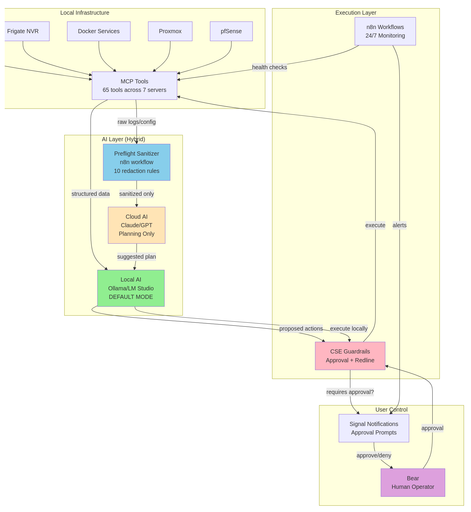

# AI-Ready Homelab Framework

**Last Updated**: 2025-11-09 | **Version**: 1.0.0

<!-- CI Badges will be added after GitHub Actions go live -->

A structured, reliable, privacy-first approach to running a homelab with local AI assistance.
This framework provides the governance, safety boundaries, documentation cadence, and operational discipline needed to use AI effectively without sacrificing control of your systems or your data.

It is not an autonomous agent.
It is not a magic AI tool.
It is an operating model.

---

## Purpose

Modern homelabs often evolve into complex environments: Docker services, Home Assistant, Proxmox, pfSense, Frigate, databases, backups, automations, and log pipelines.
With that complexity comes the usual problems:

* silent failures
* configuration drift
* undocumented changes
* backup gaps
* inconsistent updates
* "fix it later" behavior
* AI tools that are powerful but unsafe without structure

This framework introduces an SRE-inspired way to operate a homelab: predictable, documented, observable, and safe.
AI becomes an assistant rather than an improvisational actor.

---

## Why This Framework Exists

Most homelab problems are not caused by carelessness. They come from the absence of:

* operational rhythm
* documentation habits
* verification windows
* safe-change workflows
* guardrails for automation
* clear boundaries for AI involvement

This framework introduces those elements in a lightweight but effective way.
The result is a homelab that behaves more like real infrastructure: stable, predictable, and understandable.

---

## Real-World Results

These improvements were measured directly from STATUS.md history and DR drill logs:

* Reduction in silent regressions after updates
* Fewer service restarts needed
* Increased backup coverage and reliability
* Dramatically improved detection of drift
* Faster incident response through structured runbooks

<sub>Metrics captured from STATUS.md history and DR drill logs.</sub>

### Case Study: Catching a Frigate Regression

After a routine Docker restart, everything appeared normal visually.
However, STATUS.md noted increased camera reconnections within 12 hours.
A regression was identified early and corrected before it became a larger reliability problem.

This is the value of verification windows and structured operational cadence.

---

## Who This Is For

* Homelab owners who want reliability, not constant tinkering
* Privacy-minded self-hosters
* Users of Home Assistant, Docker, Proxmox, Frigate, pfSense, n8n, ZFS, and similar stacks
* Anyone interested in applying light SRE discipline to personal infrastructure
* People who want AI assistance without surrendering data or control

---

## What This Framework Is Not

* Not a magic AI that "runs your homelab"
* Not an agent you allow to act unsupervised
* Not a scripted homelab distribution
* Not a cloud-dependent tool
* Not a replacement for human judgment

This framework provides structure; you remain in control.

---

## Getting Started (Simple Path)

If you're new to this, begin with the minimum viable setup:

1. **Copy the starter templates**:
   ```bash
   cp samples/STATUS.sample.md STATUS.md
   cp samples/PENDING-WORK.sample.md PENDING-WORK.md
   ```

2. **Fill out STATUS.md once** with your current homelab state.

3. **Pick one service and create a basic runbook** (restart procedure, log check, validation steps).

4. **Implement your first verification window**:
   Make one change, mark it pending, revisit in 24–48 hours, and document the outcome.

5. **Expand gradually**.
   One service at a time, one runbook at a time.

This isn't meant to be adopted all at once. It's meant to grow with you.

---

## How It Works (High-Level Flow)

The general operating model looks like this:

1. You describe an intended change or task.
2. AI generates a plan within the boundaries of CSE guardrails.
3. The plan is reviewed and approved by you.
4. Any sensitive data is sanitized before leaving the network (if hybrid mode is used).
5. Actions are executed locally through MCP tools or runbooks.
6. STATUS.md is updated.
7. A verification window ensures system stability.
8. The change is marked complete.

This cycle keeps operations safe, auditable, and predictable.

---

## Why This Approach Works

Homelabs degrade not from big mistakes but from small, accumulated ones:

* restarts without follow-up
* configuration edits without documentation
* updates without rollback plans
* improvements without verification
* logs that go unchecked

By applying cadence, documentation, and guardrails, your systems stay reliable over time.

---

## What Makes This Framework Distinct

### 1. SRE Governance

Lightweight operational discipline adapted for homelabs: STATUS cadence, verification windows, incident recording, and runbooks.

### 2. Local-First AI

AI operates entirely on your local models.
Hybrid mode is optional and privacy-preserving.

### 3. Guardrails for Safety

The CSE policy system prevents destructive actions, scopes automation properly, and enforces human approval.

### 4. Privacy and Sanitization

A dedicated n8n workflow strips sensitive data before any cloud use.
Nothing leaves your network without inspection.

### 5. Architecture Transparency

Every component is documented visually and textually with complete diagrams.

---

## Three Ways to Use This

### 1. Quick Start (10 minutes)

If you just want structure:

* Copy the `samples/` folder
* Start filling out STATUS and PENDING-WORK
* Add runbooks for your top 3 services
* Done

### 2. Intermediate (2–3 hours)

If you want governance:

* Implement STATUS cadence
* Add runbooks for HA, Docker, backups
* Add DR test plan
* Begin agent-assisted runbooks (local-only)

### 3. Full Implementation (6–12 hours)

If you want the complete operating system:

* Deploy local AI model
* Configure MCP servers
* Install agent suite
* Harden CSE supervision
* Segment your homelab
* Implement the full SRE kit
* Begin automated reliability reviews

---

## Architecture Diagrams

**Visual Gallery**: See all diagrams rendered in [`docs/architecture/diagrams/README.md`](docs/architecture/diagrams/README.md)

### Core Architecture

* [`local-ai-ops.mmd`](docs/architecture/diagrams/local-ai-ops.mmd) — Local-first AI operations
* [`network.mmd`](docs/architecture/diagrams/network.mmd) — VLAN-segmented homelab
* [`services.mmd`](docs/architecture/diagrams/services.mmd) — Agents + services + MCP flow

### Hybrid AI Architecture



* [`hybrid-ai.mmd`](docs/architecture/diagrams/hybrid-ai.mmd) — Hybrid AI architecture (local + cloud planning)
* [`cse-guardrails.mmd`](docs/architecture/diagrams/cse-guardrails.mmd) — CSE approval and redline workflow
* [`hybrid-mode-switch.mmd`](docs/architecture/diagrams/hybrid-mode-switch.mmd) — Mode switching FSM (local/hybrid/cloud-enhanced)

### Privacy Guardrails

* [`tools/n8n/preflight_sanitize.n8n.json`](tools/n8n/preflight_sanitize.n8n.json) — n8n workflow for redacting secrets before cloud planning
* [`sre-kit/examples/cse-policy.example.yaml`](sre-kit/examples/cse-policy.example.yaml) — Complete CSE policy template with approval workflow
* [`.github/workflows/cse-policy-validate.yml`](.github/workflows/cse-policy-validate.yml) — CI validation for CSE policy files

---

## Documentation

### Core Framework
* [`sre-kit/STATUS-workflow.md`](sre-kit/STATUS-workflow.md) - How to maintain STATUS.md (comprehensive guide)
* [`sre-kit/incident-template.md`](sre-kit/incident-template.md) - Incident documentation
* [`sre-kit/dr-test-matrix.md`](sre-kit/dr-test-matrix.md) - Disaster recovery testing
* [`samples/STATUS.sample.md`](samples/STATUS.sample.md) - Service health tracking template
* [`samples/PENDING-WORK.sample.md`](samples/PENDING-WORK.sample.md) - Project tracking template
* [`sre-kit/`](sre-kit/) - Complete SRE governance templates

### Comparisons & Positioning
* [`docs/comparisons/vs-homelab-mcp-repos.md`](docs/comparisons/vs-homelab-mcp-repos.md) — How this framework relates to other homelab projects

---

## Quick Start Guide

### Step 1: Clone This Repository

```bash
git clone https://github.com/Osezno-byte/AI-Ready-Homelab.git
cd AI-Ready-Homelab
```

### Step 2: Set Up Your Documentation

```bash
# Copy templates
cp samples/STATUS.sample.md STATUS.md
cp samples/PENDING-WORK.sample.md PENDING-WORK.md

# Start tracking your infrastructure
# Edit STATUS.md with your current service state
```

### Step 3: (Optional) Deploy Local AI

```bash
# Install Ollama
curl -fsSL https://ollama.com/install.sh | sh

# Pull a model
ollama pull llama3.1:8b  # 8GB RAM minimum

# Test it
ollama run llama3.1:8b "Explain Docker health checks"
```

### Step 4: Implement SRE Governance

```bash
# Copy SRE kit templates
mkdir -p docs/governance docs/reliability
cp sre-kit/STATUS-workflow.md docs/governance/
cp sre-kit/incident-template.md docs/governance/
cp sre-kit/dr-test-matrix.md docs/reliability/

# Start your first DR drill
# Follow docs/reliability/dr-test-matrix.md
```

---

## Repository Structure

```
ai-ready-homelab/
├── README.md                      # This file
├── sre-kit/                       # SRE governance templates
│   ├── STATUS-workflow.md         # How to maintain STATUS.md
│   ├── incident-template.md       # Incident documentation
│   ├── dr-test-matrix.md          # Disaster recovery testing
│   └── examples/
│       └── cse-policy.example.yaml # CSE policy template
├── samples/
│   ├── STATUS.sample.md           # Service health tracking
│   └── PENDING-WORK.sample.md     # Project tracking
├── docs/
│   ├── architecture/              # System design & diagrams
│   ├── comparisons/               # vs other solutions
│   └── governance/                # Operating procedures
├── tools/
│   ├── n8n/                       # n8n workflows
│   │   └── preflight_sanitize.n8n.json
│   └── cse_policy_validator.py    # CSE policy validator
└── .github/
    └── workflows/
        └── cse-policy-validate.yml # CI validation
```

---

## How This Fits Into the Ecosystem

The homelab AI space is developing rapidly.
Several projects provide tools, MCP servers, or deployment stacks.
This framework addresses a different part of the problem: governance, operational safety, and reliable AI integration.

Most projects focus on capability.
This framework focuses on sustainability.

### Related Projects

The projects below solve adjacent problems and can be used alongside this framework.

**bjeans/homelab-mcp** provides MCP servers for Docker, Ollama, Pi-hole, and Unifi.
These are tools this framework can integrate with.

**ai-stack-homelab** provides local AI deployment infrastructure.
This framework builds on that foundation with governance, runbooks, and guardrails.

**awesome-mcp-servers** catalogs available MCP tools.
This framework provides the methodology for using those tools safely and reliably.

These projects are complementary, not competitive.

**See full comparison**: [`docs/comparisons/vs-homelab-mcp-repos.md`](docs/comparisons/vs-homelab-mcp-repos.md)

---

## Frequently Asked Questions

### Does this require cloud AI services?

No. The framework is designed to run entirely on local models (Ollama, LM Studio, etc.).
Hybrid mode is optional and only uses cloud AI for planning, with mandatory sanitization.

### What hardware do I need for local AI?

**Minimum**: 16GB RAM, 20GB disk, CPU inference (llama3.1:8b or mistral:7b)
**Recommended**: 32-64GB RAM, 100GB disk, NVIDIA GPU with 24GB+ VRAM for larger models
**Optimal**: 64-128GB RAM, 500GB SSD, NVIDIA GPU with 48GB+ VRAM for multiple models

You can start with CPU-only and upgrade later.

### Is this only for homelabs?

No. The framework works for any self-hosted infrastructure: small business servers, development environments, research labs, or edge deployments.
The principles scale from single-node setups to multi-node clusters.

### Do I need to use all the SRE templates?

No. Start with STATUS.md and one verification window.
Add runbooks and governance patterns gradually as you find value in them.
The framework is modular by design.

### How long does implementation take?

**Quick start**: 10 minutes (copy templates, fill out STATUS.md)
**Intermediate**: 2-3 hours (add governance, runbooks, DR plan)
**Full implementation**: 6-12 hours (local AI, MCP servers, agents, complete SRE kit)

Most users start small and expand over weeks or months.

### Can I use this with my existing homelab?

Yes. The framework is designed to integrate with existing infrastructure.
You don't need to rebuild anything.
Start by documenting your current state in STATUS.md and go from there.

### What if I don't use Home Assistant or Proxmox?

The framework is tool-agnostic.
The templates and patterns work with any infrastructure: pure Docker, Kubernetes, LXD, ESXi, etc.
The examples use Home Assistant and Proxmox because those are common, but the methodology applies universally.

### Is this production-ready?

Yes. The framework has been validated in a production homelab for months.
However, you should test any changes in your environment before applying them to critical systems.

### How do I get help?

* **GitHub Discussions** for questions and implementation help
* **GitHub Issues** for bugs or feature requests
* **Documentation** in `sre-kit/` and `docs/`

Response time is usually 24-48 hours.

---

## Security Model Summary

- Local-only execution — all actions run on your LAN via MCP tools
- Sanitized cloud planning — no raw logs or personal data ever leave the LAN
- Redlines enforce hard blocks for WAN rules, volume deletion, credential changes, destructive ops
- Approvals with TTL ensure risky operations require human confirmation
- No raw persistence — raw logs/configs never get stored inside workflows
- CSE acts as the safety officer — all AI actions go through policy checks

---

## Status

This framework is under active development. Feedback, issues, and contributions are welcome.


---

## Contributing

This is an open framework under active development.

**Ways to contribute**:
* Share your STATUS.md patterns
* Submit runbook templates
* Report issues or suggest improvements
* Share your implementation stories

See [CONTRIBUTING.md](CONTRIBUTING.md) for detailed guidelines.

---

## License

MIT License - free to use, modify, and build on.

See [LICENSE](LICENSE) for details.

---

## Community & Support

### Free Resources
- **GitHub Discussions**: Ask questions, share implementations
- **GitHub Issues**: Report bugs, request features
- **Documentation**: Complete guides in [`docs/`](docs/)

### Professional Services (Optional)

**This framework is fully usable for free.** Professional services are optional and low-volume.

**Local AI Conversion Package** - $497/$997
- Turnkey local AI setup
- Privacy-first by design
- No cloud dependency
- Expert implementation

**Implementation Consulting** - $150-250/hour
- SRE governance setup
- Custom agent development
- Infrastructure review

**More information**: Inquire via GitHub Discussions

---

## Built By

**Bear** ([@Osezno-byte](https://github.com/Osezno-byte))
- Infrastructure architecture
- Production homelab validation
- SRE pattern development

**Solace** (ChatGPT o1)
- Strategic positioning
- Competitive analysis
- Monetization strategy

**Claude** (Anthropic)
- Documentation development
- Technical implementation
- Framework architecture

---

**Repository Status**: Active Development | Public Launch: November 2025
**Last Updated**: 2025-11-09

---

## Star This Repo

If this framework helps you:
- Star this repository
- Share with your homelab community
- Join discussions and share your implementation
- Contribute templates and improvements

**Built something cool with this framework?** [Share it in Discussions!](https://github.com/Osezno-byte/AI-Ready-Homelab/discussions)
