# Architecture Diagrams

[← Back to README](../../../README.md)

This page contains all architecture diagrams for the AI-Ready Homelab Framework.
Each diagram is rendered directly on GitHub using Mermaid, and reflects the framework's core design patterns.

## Hybrid AI Architecture

The hybrid AI architecture shows how local and cloud AI work together with privacy guardrails.

## CSE Guardrails

The CSE (Claude Supervised Execute) guardrails provide policy-based approval workflow with redline protection.

```mermaid
flowchart TD
    START[AI Proposes Action] --> PARSE[Parse Command]
    PARSE --> CHECK_POLICY{Matches CSE Policy?}

    CHECK_POLICY -->|No policy match| DENY[❌ Auto-Deny<br/>Log to audit]
    CHECK_POLICY -->|Yes| CHECK_REDLINE{Redline Trigger?}

    CHECK_REDLINE -->|Yes<br/>rm -rf, dd, mkfs, etc| REDLINE[🚨 REDLINE<br/>Block immediately<br/>Alert user<br/>Require manual review]
    CHECK_REDLINE -->|No| CHECK_APPROVAL{Requires Approval?}

    CHECK_APPROVAL -->|Yes| NOTIFY[📱 Send to Signal/Telegram<br/>Show command + context<br/>Start 120s timeout]
    CHECK_APPROVAL -->|No<br/>Auto-approve mode| VALIDATE[Validate command syntax]

    NOTIFY --> WAIT{User Response?}
    WAIT -->|Approve within 120s| VALIDATE
    WAIT -->|Deny| DENY
    WAIT -->|Timeout| DENY

    VALIDATE --> CHECK_DRY{Dry-run Available?}
    CHECK_DRY -->|Yes| DRY_RUN[Execute with --dry-run]
    CHECK_DRY -->|No| EXECUTE

    DRY_RUN --> DRY_CHECK{Dry-run Success?}
    DRY_CHECK -->|No| DENY
    DRY_CHECK -->|Yes| EXECUTE[✅ Execute Command]

    EXECUTE --> LOG[Log to audit trail<br/>Command + user + timestamp]
    LOG --> VERIFY[Verify execution result]
    VERIFY --> REPORT[Report to user<br/>Success/failure + output]

    DENY --> REPORT
    REDLINE --> REPORT

    style REDLINE fill:#FF6B6B
    style DENY fill:#FFB6C1
    style EXECUTE fill:#90EE90
    style NOTIFY fill:#87CEEB
    style VALIDATE fill:#DDA0DD
```

## Mode Switch FSM

The mode switching finite state machine shows transitions between local-only, hybrid, and cloud-enhanced modes.

## Local AI Operations

Local-first AI operations architecture showing privacy-preserving infrastructure.

## Network Topology

VLAN-segmented homelab network with isolation and security zones.

## Services Architecture

Service integration showing MCP tools, custom agents, and automation workflows.

